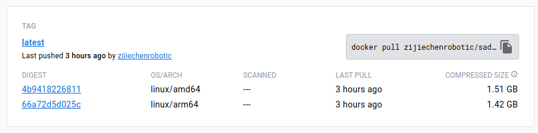

# 自动驾驶中的SLAM技术Docker环境布署

本文档提供**自动驾驶中的SLAM技术**的标准开发环境, 支持arm64和amd64架构的cpu，旨在减少同学们环境配置的工作量。

自动驾驶中的SLAM技术代码地址

```
https://github.com/gaoxiang12/slam_in_autonomous_driving
```

配套课程

```
https://www.shenlanxueyuan.com/my/course/615
```

Dockerfile开源在

```
https://github.com/kris6767679/slam_in_autonomous_driving_docker
```

## 安装Docker

### Linux

Linux系统只需安装docker engine，参考官网：https://docs.docker.com/engine/install/ubuntu/

具体步骤为

```bash
sudo apt-get update

sudo apt-get install docker-ce docker-ce-cli containerd.io docker-buildx-plugin docker-compose-plugin

sudo docker run hello-world
```

为了能在非**sudo**模式下使用Docker, 需要将当前用户加入Docker Group

```bash
# 加入group
sudo usermod -aG docker $USER

# 重启一下电脑, 使上述变更生效
reboot
```

运行hello-world出现以下画面表示docker安装成功


### Windows

进入https://www.docker.com/下载Docker Desktop for Windows并安装

启动Docker Desktop，您将看到如下画面（刚下载好是没有containers的）


启动PowerShell，输入docker run hello-world，如果看到以下画面，则证明安装成功


### MacOS

步骤与windows下类似, 安装docker desktop, 然后测试hello-world判断是否安装成功

## 拉取镜像

终端或powershell输入，约4.88GB

```bash
# 国内用户
docker pull registry.cn-guangzhou.aliyuncs.com/zijiechenrobotics/sad-workspace:latest

# 国外用户
docker pull zijiechenrobotic/sad-workspace:latest
```

image使用buildx进行跨平台编译, 可以支持amd64和arm64架构的cpu，即可以在windows，ubuntu以及macos中运行。



若阿里云的image不能在arm64中运行，可以尝试拉取docker hub中的image

## 启动镜像

新建一个`docker-compose.yml`文件，内容如下

```yaml
version: '3.4'
services:
  sad-workspace:
    image: registry.cn-guangzhou.aliyuncs.com/zijiechenrobotics/sad-workspace:latest
    # or
    # image: zijiechenrobotic/sad-workspace:latest
    environment:
      - VNC_PW=abc123 # vnc密码，可以改成自己想要的密码
      - VNC_GEOMETRY=1920x1080 # vnc分辨率
      - VNC_DEPTH=24 # 颜色位数16/24/32可用，越高画面越细腻，但网络不好的也会更卡
    volumes:
      - ./workspace:/root/workspace # 存储空间映射，映射到放代码的空间
    ports:
      # noVNC port:
      - 46080:6080
      # standard VNC port:
      - 45901:5901
```

以及一个workspace文件夹，用于存放git clone代码。具体摆放如下


终端cd到yml文件的目录下，输入以下命令，启动docker

```
docker compose up -d
```

关闭docker

```
docker compose down
```

### 通过浏览器访问ubuntu桌面

任意浏览器，地址栏输入

```
localhost:46080
```

点击其中的`vnc.html`，再点击`连接`，输入**yml文件中的vnc密码**即可进入桌面

同时，可以点击左边`设置`，使用`缩放模式：本地缩放`得到更好的操作体验

### 通过VNC访问ubuntu桌面

需要下载任意支持vnc协议的远程桌面助手，如：vncviewer。

vnc的ip，请输入

```
localhost:45901
```

## 编译课程代码

终端cd到workspace目录下，clone课程代码

```bash
git clone https://github.com/gaoxiang12/slam_in_autonomous_driving.git
```

通过浏览器或vnc件进入docker容器的workspace中

```bash
# 首先编译g2o
cd slam_in_autonomous_driving/thirdparty/g2o/
cmake .
make -j8 # 按照自己电脑性能设置使用的核心数，这里使用了8个

# 然后正式编译课程代码
cd ../../../
mkdir build
cd build
make -j8 # 按照自己电脑性能设置使用的核心数
```

编译完成就可以尝试运行一下代码:

```
./bin/motion
```

可以看到如下界面则证明编译成功，可以开始愉快地学习了:smile:


在之后的学习代码中，同学们可以使用**vscode**中的**Dev Containers**插件进入docker容器，从而进行代码编写，然后使用浏览器或vnc进行效果的可视化。由于使用了存储空间映射，workspace中的内容独立于容器，容器关闭后不影响workspace中的文件，即编译一次后，下一次进入docker不需要重新编译程序。

## 已知问题

### 终端使用不了g2o_viewer

sad代码依赖thirdparty中的g2o，为了减少image的大小，image中并未安装g2o。因此在运行第九章代码时使用不了g2o_viewer查看闭环检测的位姿图。解决思路为：

```bash
# 在源码中启动g2o
./thirdparty/g2o/bin/g2o_viewer

# 通过g2o_viewer中的“load”加载第九章的位姿图
```

